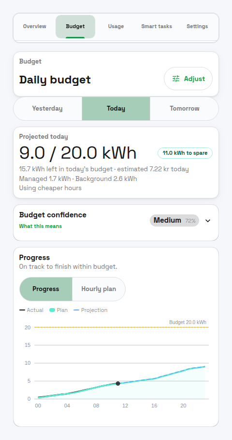
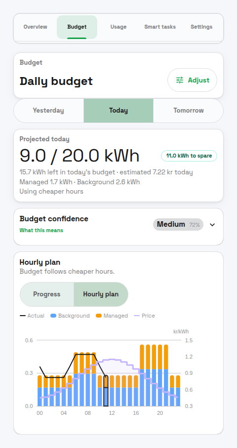

# Daily Energy Budget

The Daily Energy Budget is your daily kWh target. You set, for example, "I want the house to use no more than 50 kWh today." PELS spreads that target across the hours of the day and paces the home so it lands on plan — leaning on cheaper hours, easing off when usage gets ahead.

## Why set a daily budget?

The hourly hard cap is a limit you *have* to set: it stops the home exceeding your grid tariff step (effekttrinn) or tripping a breaker. The daily budget is a limit you *choose* to add on top, when you want one of these:

- **Spend less by leaning on cheap hours.** With price optimization enabled, the budget gives cheaper hours more of the day's energy and expensive hours less, so flexible load — water heater, floor heating, EV charger — runs when power is cheapest. This is the main money lever.
- **Use less, deliberately.** If you want the whole home to stay under a daily energy ceiling — to keep cost down, cut waste, or just stay disciplined — the budget paces every hour toward that total instead of letting the day run flat out.
- **Smooth the day so peaks are rarer.** Pacing whole-home usage across the day makes it less likely you bump up against the hard cap during busy evening hours.

**You may not need it.** If your only goal is to stay under the grid tariff step or breaker, the hard cap alone already does that. The daily budget is the extra layer you add for cheap-hour shifting or conscious whole-home reduction, and it is off by default.

**A budget caps energy, not money.** The target is in kWh, and the price of each kWh varies through the day. The savings come from *shifting* usage into cheap hours, not from the kWh number itself — a low budget on an expensive day can still result in high costs.

## How it relates to the hard cap

The daily budget is a **soft pacing target**, separate from the hourly hard cap. PELS keeps running across it, devices keep heating, and the only thing that ever raises an urgent alarm is the **hourly hard cap** (your grid tariff step or breaker limit). Daily budget shapes the day; the hard cap protects the grid connection.

PELS reads your existing whole-home power meter to track today's usage — the same data you already see in the Usage tab. You do not need to set up anything extra.

If you have solar production, Homey Energy may report the whole-home total as net grid import. PELS uses that net total for budget totals and pacing, so exported solar does not subtract energy below zero. The managed/background split can still show `Before solar:` when device meters show gross usage that solar production covered locally.

## What you'll see on the Budget page

The figures below are the **Budget** page on a phone, a little after 11:00 on a day with a 20 kWh budget.

*Figure 1. The Plan view answers, "where will I land today?" The big number is the projected end-of-day usage against today's budget — 9.0 of 20.0 kWh, with 11.0 kWh to spare — alongside how much budget is left to spend right now and an estimated cost. The Progress chart traces actual usage (black) against the planned curve (green) and the budget ceiling (dashed).*

The Hourly plan view is where you can see how the day's energy lines up with prices:

*Figure 2. The Hourly plan view shows planned energy per hour, split into background usage (blue) and managed-device usage (orange), with the price line (purple) on top. This is the view where you check whether managed load is landing in the cheaper hours: with price optimization on, the budget steers it that way.*

## What a budget saves you (an example)

The numbers here are **illustrative** — your real savings depend on your own prices and how much load you can actually move. Imagine a day with 24 kWh of flexible load (a water heater and an EV) on a typical Norwegian price curve: cheap overnight, expensive morning and evening (about 0.40 kr/kWh in the cheap hours, 1.20 kr/kWh in the dear ones).

| | Budget off (runs whenever) | Budget on (price-shaped) |
| --- | --- | --- |
| Energy in the cheapest hours | 8 kWh | 18 kWh |
| Energy in the priciest hours | 16 kWh | 6 kWh |
| Average price paid | ~0.93 kr/kWh | ~0.60 kr/kWh |
| Day's energy cost | ~22 kr | ~14 kr |

Same total energy, same comfort — about a third less cost, just by letting the budget place the flexible load in the cheapest hours. The bigger the gap between cheap and expensive hours, the more a budget is worth; on a day when prices are flat there is little to shift and little to save. (If you instead lower the budget so the home uses *fewer* kWh, you save on top of this — but then something gives up energy, so set it where comfort allows.)

## Budget-Exempt Devices

Budget exemption is a control rule, not a meter rewrite:

- Exempt devices are ignored by daily budget control.
- Their real usage still counts in `used`, `remaining`, `deviation`, and budget overrun reporting.
- They are treated as background usage when PELS builds and learns the daily budget plan.
- They still count toward hourly capacity protection, including hard-cap and safety-margin limiting.

This means a budget-exempt device can leave the household over the daily budget without causing other devices to be limited just to compensate for that exempt load.

## Terminology

Shared capacity terminology and units are defined in:

- [Getting Started: Terminology and Units](getting-started.md#terminology-and-units)

Daily-budget-specific terms:

- **Daily pace** — how fast PELS thinks the house should be using power right now to land on the daily target. If you are ahead of plan, the daily pace is lower; if you are behind, it is higher.
- **Effective pace** — PELS protects the hard cap and the daily target at the same time. Whichever is stricter at the moment is the one currently in effect.
- **Allowed by now** — how much of the day's budget should have been used by this hour according to the plan.
- **Remaining** — daily budget minus what has been used so far today. Can be negative if you have already gone over.

## What It Does

- Builds a plan for how much energy should be used across the current local day.
- Tracks how much energy has been used since local midnight.
- Computes how much is "allowed by now" based on the plan.
- Computes a daily pace for the current hour from the plan.
- Freezes the plan for the rest of the day if the budget is overspent. If the day is underspent, the plan can still rebalance.
- Uses the tighter of the hourly pace and the daily pace.

## How the Daily Pace is Applied

PELS is always watching two things at once: how close the current hour is to the hard cap, and how close the day is to the daily target. Whichever needs more care right now is the one driving decisions.

If you are well under the daily target, only the hard cap matters and the day just runs normally. If you are running ahead of the daily target, PELS becomes a bit more conservative: it may keep a heater paused a little longer, or hold off on resuming a water heater until the next hour.

The daily pace can never raise the hourly hard cap. Your grid tariff step is sacred. The daily target only ever makes PELS more cautious, never less.

End-of-hour rules that protect the hard cap from a last-minute burst do not apply to the daily target. Going slightly over a daily target at 23:55 is not a problem — there is no penalty.

## Examples (Scenarios)

### 1) Over plan, daily pace becomes the tighter limit
It's 15:00. The plan says you should have used 35 kWh by now, but you have used 40 kWh.
The daily pace for this hour becomes lower than the hourly capacity pace. That reduces available power. As a result, some devices will not resume yet and low-priority devices can be limited earlier.

### 2) Behind plan, hourly capacity stays in charge
It's 10:00. The plan says 18 kWh by now, but you have used 12 kWh.
The daily pace becomes higher than the hourly capacity pace, so hourly capacity remains the tighter limit. Resumes and boosts are still allowed if there is available power.

### 3) Overspent early hour, plan freezes until you catch up
At 08:00 the plan allowed 6 kWh, but you already used 7.5 kWh.
The daily budget "freezes" the plan while you are over plan. Once usage drops back under plan, it can rebalance again.

### 4) Price shaping enabled
You enable price shaping and prices are cheap from 01:00–05:00 and expensive in the evening.
The daily plan shifts more of the remaining allowance to cheap hours, which raises the daily pace overnight and lowers it during expensive hours.

### 5) Daily budget off
Daily budget disabled means PELS uses only hourly capacity and price optimization, if enabled. There is no daily pacing.

## Where To Configure It

The main daily budget surface is the **Budget** page. You can reach its settings two ways: the **Adjust** button on the Budget page header, or the **Daily budget** row on the Settings page — both open the same Adjust view. When you arrive from Settings, **Done** takes you back to Settings.

The page has two local views:

| View | What it does |
| --- | --- |
| **Plan** | Shows the selected day's progress, hourly plan, confidence, and current status. |
| **Adjust** | Lets you preview and apply daily-budget changes before they become active. |

The **Adjust** view includes:

- **Enable daily budget**: turns the feature on/off.
- **Daily budget (kWh)**: target daily energy use. Range: 20–360 kWh.
- **Use cheaper hours**: when price optimization is enabled and prices are reliable, the plan is weighted toward cheaper remaining hours.
- **Background usage reserve**: how much daily budget PELS holds back for household usage it cannot move, such as appliances, lights, and unmanaged devices.
- **Managed device flexibility**: how freely PELS may shift managed-device usage toward cheaper hours after preserving minimum service.

Use **Preview changes** before applying. PELS shows the candidate plan so you can compare it with the current plan. Changes in the Adjust view do not save until you apply them. Pressing **Done** with unsaved changes asks you to confirm first; switching to another tab discards them immediately (a notice appears).

### Behavior Shaping

The shaping controls live in the Adjust view's **Budget shaping** section:

- **Background usage reserve**: `Balanced` uses the normal reserve. `Conservative` reserves more, which can reduce daily-budget misses but leaves less budget for managed devices.
- **Managed device flexibility**: `Low` stays close to normal managed-device usage, `Medium` shifts some usage, and `High` shifts more aggressively toward cheaper feasible hours.

A related display-only option, **Show daily budget breakdown in the chart** (stacks background usage and managed device usage), is under **Settings > Advanced > Daily budget chart**.

**Warning:** the shaping controls can significantly change pacing behavior and when devices are limited or resumed. Keep defaults unless you are deliberately tuning behavior. If you change them, adjust one parameter at a time and observe at least a full day.

For exact formulas and worked examples, see [Daily Budget Weighting Math (Advanced)](daily-budget-weights.md).

## Plan View

The **Plan** view shows a selected-day chart and live stats:

- **Used**: kWh used so far today (local time).
- **Allowed now** or **Budget this hour**: cumulative or hourly kWh that the plan allows up to the current hour.
- **Remaining**: daily budget minus used (can be negative).
- **Deviation**: used minus allowed so far (positive means over plan).
- **Budget confidence**: backtested forecast-skill score - how regular the home's hourly usage is, and how well it follows shifted budget plans when managed load exists.
- **Use cheaper hours**: shows whether price-aware shaping is active.
- **Plan frozen**: appears while budget-managed load is over plan; exempt devices can leave reporting over plan without freezing the daily plan.

The chart can show **Progress** or **Hourly plan**. Progress focuses on whether the selected day is on track. Hourly plan shows the planned kWh per hour, with actual kWh for completed hours when available.

### Buckets and DST

Buckets are computed from local midnight to the next local midnight. On DST transitions, the number of buckets can be 23 or 25, and hour labels may repeat on fall-back days.

## How the Plan Works (High Level)

- **Default profile**: a safe baseline distribution across the day.
- **Learned profile**: updated at the end of each day from actual usage.
- **Profile blending**: ramps from default to learned over time (internal, not shown in UI).
- **Price shaping** (optional): shifts remaining allowance between the effective floor and cap based on today's prices.

The plan is a cumulative curve. The current bucket's planned kWh is turned into a daily pace for that hour, and the planner uses the tighter of the hourly capacity pace and daily pace.

## Interaction With Other Features

- **Hourly capacity limit (hard cap)**: Always enforced. Daily budget never bypasses it. Only projected breaches of this hourly hard-cap budget trigger urgent manual-action Flows.
- **Daily pace**: Combined with the hourly pace by taking the tighter limit. Never triggers emergency alarms.
- **Budget-exempt devices**: Skipped by daily-budget control, but still visible in real usage and still managed by hourly capacity protection.
- **Price optimization**: Can reshape the daily plan if price shaping is enabled.
- **Smart tasks**: Still respect the hard cap. Daily budget can make a task more conservative when the day is already over plan.

## Insights

These are exposed on the PELS Insights device:

- `pels_hourly_limit_kw` (the current effective hourly limit in kW)
- `pels_daily_budget_remaining_kwh`
- `pels_daily_budget_exceeded`
- `pels_limit_reason` (indicates whether limits are due to hourly or daily budget)
