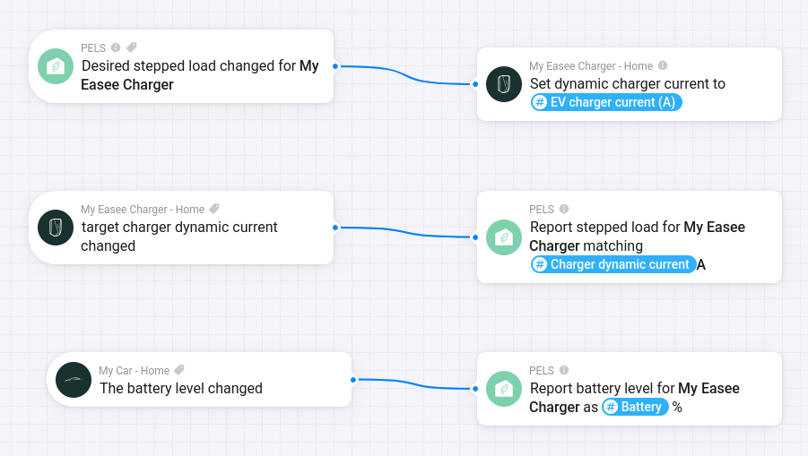

# Configure an EV Charger

Use this guide when an EV charger is paired in Homey and PELS should decide how much charging current is available.

The convenient setup is to let PELS use an EV charger control mode. PELS then calculates the current in amps for you, and your Homey Flow only maps that value to the charger app's current-control action.

Vendor-specific examples:

- [Zaptec EV Charger](/zaptec-ev-charger)

## Before You Begin

- PELS must already be installed and configured with live whole-home power data.
- Your EV charger must already be paired in Homey.
- You need to know whether the charger should be controlled as 1-phase or 3-phase charging.

If PELS is not set up yet, start with [Getting Started](/getting-started).

## Step 1: Open the Charger Settings

Open **Apps -> PELS -> Settings -> Devices**. The charger should appear there. Refresh the device list if it does not.

## Step 2: Choose the EV Control Mode

Open the charger in the **Devices** tab and choose the EV control mode that matches your installation:

| Control mode | Use when |
| --- | --- |
| **EV 1-phase** | PELS should plan charging as single-phase current. |
| **EV 3-phase** | PELS should plan charging as three-phase current. |

This is more convenient than a manual stepped-load setup because PELS can expose **EV charger current (A)** directly in the Flow. Manual stepped-load setup can still work, but then you must convert watts to amps yourself.

Then configure the charger as a normal managed device:

1. Enable **Managed by PELS**.
2. Enable **Power-limit control**.
3. Set a priority that matches how important EV charging is compared with heaters, water tanks, and other managed devices.

Lower priority numbers are more important. Devices with higher numbers are limited first when PELS needs to stay under the hard cap.

## Step 3: Create the Charger Current Flow

Create the Flows that connect PELS to the charger app. The first Flow sends PELS' desired current to the charger. The second Flow reports the selected current back to PELS when your charger app can expose it.

*Figure 1. Example EV charger wiring: PELS emits the desired charger current, the charger reports the selected current back into PELS, and the car reports battery level for boost mode.*

### Send desired current to the charger

Use this Flow shape:

| Flow part | Card |
| --- | --- |
| **When** | PELS: **Desired stepped load changed for** your charger |
| **Then** | Your charger app: set available charging current |

In the charger app action card, use the PELS Flow tag **EV charger current (A)** for the current value.

PELS handles the 1-phase or 3-phase conversion based on the control mode you selected in Step 2. Do not use **Planning power (W)** for a charger current field unless you are intentionally building a manual conversion Flow.

### Report selected current back to PELS

If your charger app reports the selected current, add this Flow:

| Flow part | Card |
| --- | --- |
| **When** | Your charger app: charger current changed |
| **Then** | PELS: **Report stepped load for** your charger **matching** the charger-current tag |

This feedback lets PELS confirm which charging level the charger selected. Use the charger app's current tag, not **EV charger current (A)**, in this feedback Flow.

When the reported value is amps, add `A` after the tag in the **matching** field, for example `[[Charger dynamic current]] A`. Without the `A` suffix, Homey may pass the number without a unit and PELS cannot reliably match it as charger current.

## Step 4: Configure Boost Mode Battery Reporting

This step is optional. Basic capacity control does not need battery reporting.

If you want EV boost mode to react to the car battery level, the car or charger app must expose a battery percentage trigger or tag in Homey. Then create a Flow that reports the battery percentage to PELS whenever Homey receives a new battery level.

Use this Flow shape for boost mode:

| Flow part | Card |
| --- | --- |
| **When** | Your car or charger app: battery level changed |
| **Then** | PELS: **Report battery level for charger** |

Choose the same charger in the PELS action card, and map the battery percentage tag from the car or charger app to **battery level**.

After this Flow is running, PELS has battery reporting for the charger. EV boost mode can use that battery level to give the charger extra priority while the car is below the configured boost threshold.

## Step 5: Check the Setup

Start with **Simulation mode** if you are still tuning the rest of PELS. Then verify:

1. The charger is visible as a managed device in PELS.
2. The charger uses **EV 1-phase** or **EV 3-phase** control mode.
3. The current-control Flow receives **EV charger current (A)** when PELS changes the desired charging level.
4. Charging current changes in the charger app when PELS asks for a lower or higher level.
5. If you configured boost mode battery reporting, battery percentage appears in PELS after the battery reporting Flow runs.

## Troubleshooting

| Problem | What to check |
| --- | --- |
| The charger is not listed in PELS | Confirm the charger is paired in Homey and refresh the Devices tab. |
| The Flow does not trigger | Confirm the charger is managed, power-limit control is enabled, and PELS has live whole-home power data. |
| The charger receives the wrong current | Check that the device uses the correct **EV 1-phase** or **EV 3-phase** control mode. |
| Battery level does not update in PELS | Check that the battery reporting Flow uses the same charger device as the current-control Flow. |
| PELS never limits the charger | Check the charger priority, hard cap, safety margin, and whether Simulation mode is still enabled. |

## Related Pages

- [Getting Started](/getting-started)
- [Configuration](/configuration)
- [Flow Cards](/flow-cards)
- [Deadline Charging With State of Charge](/how-to-deadline-charging-soc)
- [Zaptec EV Charger](/zaptec-ev-charger)
