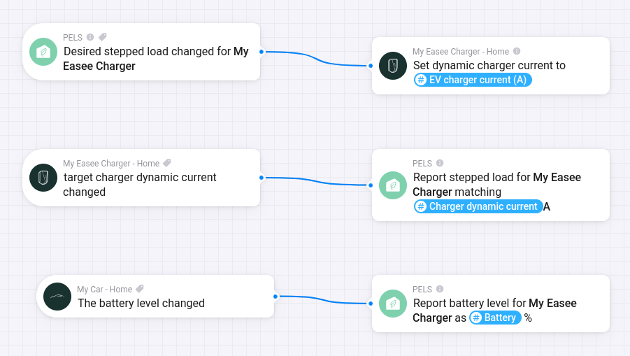

# Configure an EV Charger

Use this guide when an EV charger is paired in Homey and PELS should decide how much charging current is available.

The convenient setup is to let PELS use an EV charger control mode. PELS then calculates the current in amps for you, and your Homey Flow only maps that value to the charger app's current-control action.

For some chargers PELS sets the current directly through the charger app, and no Flow is needed for it.

Vendor-specific guides:

- [Easee EV Charger](/easee-ev-charger): PELS controls the current directly, so skip Step 3.
- [Zaptec EV Charger](/zaptec-ev-charger)

## Before You Begin

- PELS must already be installed and configured with live whole-home power data.
- Your EV charger must already be paired in Homey.
- You need to know whether the charger should be controlled as 1-phase or 3-phase charging.

If PELS is not set up yet, start with [Getting Started](/getting-started).

## Step 1: Open the Charger Settings

Open **More -> Apps -> PELS -> Settings -> Devices**. The charger should appear there. Refresh the device list if it does not.

## Step 2: Choose the EV Control Mode

Open the charger in the **Devices** tab and choose the EV control mode that matches your installation:

| Control mode | Use when |
| --- | --- |
| **EV 1-phase** | 230 V single-phase charging. |
| **EV 3-phase** | Three-phase charging on a 400 V TN supply. |

The presets do not support 230 V IT three-phase charging. Neither preset is an accurate substitute for that supply and charging mode.

This is more convenient than a manual stepped-load setup because PELS can expose **EV charger current (A)** directly in the Flow. Manual stepped-load setup can still work, but then you must convert watts to amps yourself.

Then configure the charger as a normal managed device:

1. Enable **Managed by PELS**.
2. Enable **Power-limit control**.
3. Set a priority that matches how important EV charging is compared with heaters, water tanks, and other managed devices.

Lower priority numbers are more important. Devices with higher numbers are limited first when PELS needs to stay under the hard cap.

## Step 3: Create the Charger Current Flow

Skip this step for an Easee charger. See [Easee EV Charger](/easee-ev-charger).

Create the Flows that connect PELS to the charger app. The first Flow sends PELS' desired current to the charger. The second Flow reports the selected current back to PELS when your charger app can expose it.

*Figure 1. Example EV charger wiring: PELS emits the desired charger current, the charger reports the selected current back into PELS, and the car reports battery level for boost mode.*

### Send desired current to the charger

Use this Flow shape:

| Flow part | Card |
| --- | --- |
| **When** | PELS: **Stepped device target changed** for your charger |
| **Then** | Your charger app: set available charging current |

In the charger app action card, use the PELS Flow tag **EV charger current (A)** for the current value.

PELS handles the 1-phase or 3-phase conversion based on the control mode you selected in Step 2. Do not use **Planning power (W)** for a charger current field unless you are intentionally building a manual conversion Flow.

### Report selected current back to PELS

If your charger app reports the selected current, add this Flow:

| Flow part | Card |
| --- | --- |
| **When** | Your charger app: charger current changed |
| **Then** | PELS: **Report stepped load for** your charger **matching** the charger-current tag |

This feedback lets PELS confirm which charging level the charger selected. Use the charger app's current tag, not **EV charger current (A)**, in this feedback Flow.

When the reported value is amps, add `A` after the tag in the **matching** field, for example `[[Charger dynamic current]] A`. Without the `A` suffix, Homey may pass the number without a unit and PELS cannot reliably match it as charger current.

## Step 4 (Optional): Charge on Solar Surplus

If you have solar and PELS can see your export, you can have the charger follow the sun instead of running to your hard cap. In the charger's device page, turn on **Charge on solar surplus**.

PELS then picks the charging current your export covers and adjusts it as the sun changes. A charger cannot go below **6 A** — about 1.4 kW on one phase, 4.1 kW on three — so when your surplus cannot cover even that, PELS falls back to the same **Power limiting** choice it uses for your hard cap: charging is turned off, or lowered to the step you picked and topped up from the grid.

Your hard cap and daily budget still come first, and a smart task with a deadline overrides this while it is running. See [Solar and Self-Consumption](/solar) for the full picture.

## Step 5: Configure Boost Mode Battery Reporting

This step is optional. Basic capacity control does not need battery reporting.

Choose one of these battery-reporting paths for boost mode and Smart tasks:

- **Selected car:** open the charger's **Car** section and select the supported cars that charge there. PELS uses the battery level of the car it matches to the charger. Selecting a car alone does not establish a match; while the page says **Waiting to match a car**, the charger has no battery level.
- **Charger reading:** leave the car selection empty. If the charger exposes a supported battery-percentage capability, PELS reads it directly.
- **Flow reporting:** leave the car selection empty and report a battery-percentage tag from the car or charger app using the Flow below.

While any car is selected, PELS ignores both the battery-reporting Flow and the charger's own reading, even before a match is available. They do not provide fallback readings. Clear the car selection to return to those sources.

Use this Flow shape for boost mode:

| Flow part | Card |
| --- | --- |
| **When** | Your car or charger app: battery level changed |
| **Then** | PELS: **Report battery level for charger** |

Choose the same charger in the PELS action card, and map the battery percentage tag from the car or charger app to **battery level**.

With no car selected, this Flow supplies battery reports for the charger. EV boost mode can use the resulting battery level to give the charger extra priority while the car is below the configured boost threshold.

## Step 6: Check the Setup

Start with **Simulation mode** if you are still tuning the rest of PELS. Then verify:

1. The charger is visible as a managed device in PELS.
2. The charger uses **EV 1-phase** or **EV 3-phase** control mode.
3. Current control matches the charger: a new Easee setup uses **Use built-in device control**, while an existing Easee current-control Flow remains supported. Other chargers receive **EV charger current (A)** in their current-control Flow.
4. Charging current changes in the charger app when PELS asks for a lower or higher level.
5. If you configured battery reporting, the charger's **Car** section or charging readout shows the battery percentage from your chosen source.

## Troubleshooting

| Problem | What to check |
| --- | --- |
| The charger is not listed in PELS | Confirm the charger is paired in Homey and refresh the Devices tab. |
| The Flow does not trigger | For a Flow-controlled charger, including an Easee setup you chose to keep, confirm it is managed, power-limit control is enabled, and PELS has live whole-home power data. A new Easee setup can use built-in device control instead. |
| The charger receives the wrong current | Check that the device uses the correct **EV 1-phase** or **EV 3-phase** control mode. |
| Battery level does not update in PELS | If a car is selected, check whether PELS has matched it to the charger and whether that car is available in Homey. Otherwise, check the charger's own reading or that your battery-reporting Flow selects the correct charger. |
| PELS never limits the charger | Check the charger priority, hard cap, safety margin, and whether Simulation mode is still enabled. |

For problems beyond the charger — budget, capacity, or a missed task — see the full [Troubleshooting guide](/troubleshooting).

## Related Pages

- [Getting Started](/getting-started)
- [Configuration](/configuration)
- [Flow Cards](/flow-cards)
- [Deadline Charging With State of Charge](/how-to-deadline-charging-soc)
- [Easee EV Charger](/easee-ev-charger)
- [Zaptec EV Charger](/zaptec-ev-charger)
