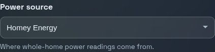
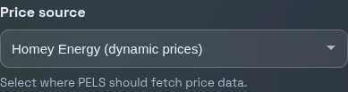
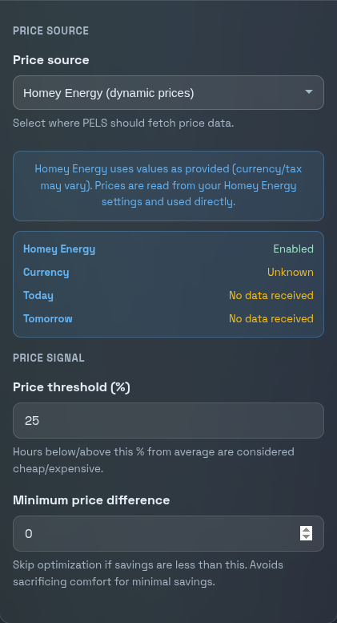

# Homey Energy + PELS

Homey Energy gives you the energy foundation PELS builds on: whole-home power, dynamic electricity prices, and per-device energy reporting. That is useful — but it does not act on that information. If you are approaching your hourly capacity limit, Homey Energy will not turn anything down. If electricity is cheap at 3 AM, it will not preheat your water tank.

**PELS bridges that gap.** It uses the Homey Energy data Homey already has — including whole-home power, electricity prices, and device energy reporting — to automatically control your devices.

If you want a quick overview of how Homey Energy works, see [Homey Energy management](https://homey.app/en-us/wiki/homey-energy-management/) and [Understanding the Homey Energy tab](https://support.homey.app/hc/en-us/articles/19383696079132-Understanding-the-Homey-Energy-tab).

## What does PELS add?

If you are already using Homey Energy, here is what PELS gives you on top:

### Automatic capacity control

PELS watches your total power consumption and automatically turns down heaters, water tanks, or EV charging before you exceed your hourly limit. When there is room again, it restores them — in the right order, based on priority. This keeps you within your grid tariff step (effekttrinn) without you having to watch the meter.

Read more: [Getting Started](/getting-started) · [Configuration](/configuration)

### Price-based load shifting

PELS reads hourly electricity prices and shifts heating to the cheapest hours of the day. During expensive hours it reduces temperatures; during cheap hours it preheats. You set the temperature deltas per device and PELS handles the rest.

Read more: [Configuration — Price tab](/configuration#price-tab)

### Modes and priorities

Set up profiles like Home, Away, Night, or Vacation with different target temperatures and priorities. PELS switches between them automatically via Flow cards, so your comfort settings adapt to your schedule.

Read more: [Configuration — Modes tab](/configuration#modes-tab)

### Daily energy budgets

Set a daily kWh target and PELS paces your controlled load across the day. It front-loads heating to cheap hours and holds back when you are ahead of budget.

Read more: [Daily Energy Budget](/daily-budget)

## Getting started

If PELS is not installed yet, get it from the [Homey App Store](https://homey.app/a/com.barelysufficient.pels). Setup takes about 15 minutes — see the [Getting Started guide](/getting-started) for a full walkthrough.

The two sections below cover how to point PELS at your Homey Energy data specifically. You can use one or both — they are independent settings.

## Power metering via Homey Energy

Homey Energy already knows your total home consumption. Instead of creating a Flow to feed that value to PELS, you can tell PELS to read it directly.

Homey Energy is also used for per-device energy reporting. Some devices report their own power directly, while others rely on Homey's estimated usage and the values configured in the device's **Energy** settings. PELS builds on that same foundation, so incorrect Energy settings in Homey can also lead to incorrect reporting or assumptions in PELS.

### Setup

1. Open **Apps > PELS > Settings**.
2. Go to the **Devices** tab.
3. Change **Power source** to **Homey Energy**.

PELS starts polling every 10 seconds. The Overview tab should show live power data within moments.

### Requirements

Your power meter must be paired with Homey and have **Tracks total home energy consumption** enabled in its device settings. This is the same cumulative reading Homey shows as "Total home consumption" in the Energy dashboard.

Common meters that work: Tibber Pulse, P1/HAN readers, Shelly EM, or any device Homey recognizes as a whole-home energy tracker.

If a device's energy data looks wrong in Homey, check its **Energy** settings there first. PELS can only work from the data Homey Energy has available.

### When to use the Flow card instead

- Your meter is not tracked by Homey Energy.
- You want to combine multiple sources or apply custom calculations before feeding the value to PELS.

::: tip
You can switch between the two sources at any time. The change takes effect immediately — no restart needed.
:::

## Electricity prices via Homey Energy

If your Homey has dynamic electricity prices configured, PELS can read them directly instead of fetching prices from its own sources.

This is especially useful if you are **outside Norway**. PELS has a built-in Norwegian spot price source with grid tariffs and electricity support, but for other countries, Homey Energy is typically the easiest way to get hourly prices into PELS.

### Setup

1. Open **Apps > PELS > Settings**.
2. Go to the **Price** tab.
3. Expand **Price settings**.
4. Change **Price source** to **Homey Energy (dynamic prices)**.

PELS fetches today's and tomorrow's prices and uses them for price-based optimization. The status card below the selector confirms whether data is flowing.

### How prices are used

PELS uses the prices as-is — it does not add grid tariffs, taxes, or surcharges on top, since Homey Energy may already include those depending on your country and configuration.

Each hour is classified as cheap, normal, or expensive based on a configurable threshold (default: 25% from average). You then set per-device temperature adjustments — for example, +4 degrees during cheap hours and -4 during expensive hours. PELS applies these automatically.

Read more: [Configuration — Price tab](/configuration#price-tab)

### When to keep using Norway pricing

If you are in Norway and want PELS to calculate the full cost including grid tariffs (nettleie), provider surcharges, and electricity support (strømstøtte), use the built-in **Norway (spot + grid tariff)** source instead. It gives you more granular control over each cost component.

## Using both together

You can use Homey Energy for both power metering and electricity prices at the same time:

- **Power source** is on the **Devices** tab.
- **Price source** is on the **Price** tab.

A typical setup for someone outside Norway: set both to Homey Energy and you are done — no Flows needed for basic operation. From there, configure your [capacity limit](/getting-started#step-2-set-your-capacity-limit), [pick which devices to control](/getting-started#step-3-choose-which-devices-pels-controls), and set up [price deltas](/configuration#price-tab).

## Next steps

- [Getting Started](/getting-started) — full setup walkthrough
- [Configuration](/configuration) — every setting explained
- [Flow Cards](/flow-cards) — trigger modes, report power, and more from Homey Flows
- [Tips and Best Practices](/tips-and-best-practices) — practical advice for getting the most out of PELS
