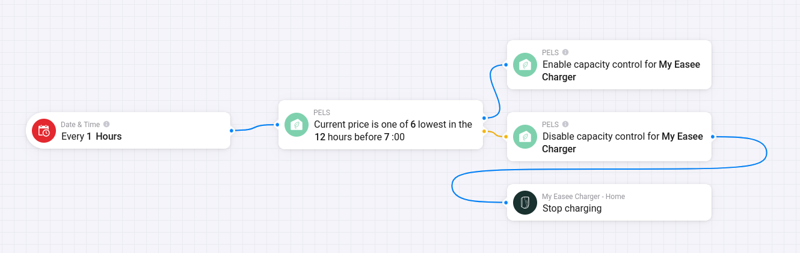

# Book Cheap Hours With Flows

Use this pattern when you want to run a device for a fixed number of cheap hours before a chosen time, without using a target-based Smart task.

The common EV example is: "Allow charging during the 5 cheapest hours before 07:00, but still let PELS reduce the charger if the home gets close to the hard cap."

*Figure 1. One Flow can check the cheapest-hour condition every hour, enable PELS control when the condition is true, and disable control plus stop charging when it is false.*

## When to Use This Instead of a Smart Task

Use Flow-booked hours when:

- You know how many hours you want.
- You want the cheapest hours in a fixed window.
- You prefer to own the schedule in Homey Flows.
- You do not need PELS to calculate a battery or temperature target.

Use a [Smart task](/smart-tasks) instead when you want PELS to plan from a target and ready-by time.

## What You Are Building

You will create two Flows:

1. A Flow that enables **Power-limit control** when the current hour is one of the cheapest hours before your end time.
2. A Flow that disables **Power-limit control** outside those selected hours and tells the device app to stop or turn off.

The device stays managed by PELS. Your Flow decides when it may run. During allowed hours, PELS still manages available power and protects the hard cap.

This pattern does not create a Smart task plan or history entry. The Flow owns the schedule; PELS owns power-limit decisions while the device is allowed to run.

## Step 1: Configure the Device

In **Apps -> PELS -> Settings -> Devices**:

1. Enable **Managed by PELS** for the device.
2. Configure the device's normal PELS control setup.
3. Turn **Power-limit control** off as the default if the device should only run during booked hours.

For an EV charger, also complete [Configure an EV Charger](/ev-charger) so PELS can send the desired current to the charger app.

## Step 2: Enable Control During the Cheapest Hours

Create a Flow like this:

| Flow part | Card |
| --- | --- |
| **When** | PELS: **Current price is one of the lowest before a time** |
| **Then** | PELS: **Enable capacity control for device** |

Card arguments:

| Argument | Example | Meaning |
| --- | --- | --- |
| **Hours** | `12` | Look back over the 12-hour window before the end hour. |
| **Lowest count** | `5` | Match the 5 cheapest hours in that window. |
| **End hour** | `7` | The window ends at 07:00 local time. |

With those values, PELS matches the 5 cheapest hours in the 12 hours before 07:00.

The trigger includes ties at the cutoff price. That means you may get more than the selected count when several hours have the same price.

## Step 3: Disable Control and Stop the Device Outside the Booked Hours

Create a second Flow that runs when the hour changes and the same condition is false.

One common shape is:

| Flow part | Card |
| --- | --- |
| **When** | Every hour |
| **And** | PELS: **Current price is one of the lowest before a time** is false |
| **Then** | PELS: **Disable capacity control for device** |
| **Then** | Charger, heater, or device app: stop charging, turn off, or set output to idle |

Use the same **Hours**, **Lowest count**, and **End hour** values as the enabling Flow.

Disabling PELS control keeps the device from starting outside the booked hours just because there is available power. The device app action stops a device that is already running when the booked hour ends.

## Example: EV Charging 5 Cheap Hours Before 07:00

Recommended device setup:

- EV charger is **Managed by PELS**.
- EV charger uses **EV 1-phase** or **EV 3-phase** control mode.
- Current-control Flow uses the **EV charger current (A)** tag.
- **Power-limit control** is off by default.

Flows:

| Purpose | Cards |
| --- | --- |
| Allow charging in selected hours | **Current price is one of the lowest before a time** with `Hours = 12`, `Lowest count = 5`, `End hour = 7` -> **Enable capacity control for device** |
| Stop allowing charging outside selected hours | Hourly trigger + same lowest-price condition is false -> **Disable capacity control for device** -> charger app: stop charging |

During selected hours, PELS can start or increase charging only when the hard cap and priority rules allow it. Outside selected hours, PELS does not try to run the charger as part of power limiting.

## Example: Water Heater 3 Cheap Hours Before 06:00

Use the same pattern with:

- `Hours = 10`
- `Lowest count = 3`
- `End hour = 6`

This lets the water heater run in the 3 cheapest hours before 06:00. If the home is already close to the hard cap, PELS can still limit the heater even inside a selected hour.

## Common Pitfalls

| Problem | Fix |
| --- | --- |
| The device runs outside selected hours | Make sure **Power-limit control** is disabled outside the chosen hours and that the Flow also tells the device app to stop or turn off. |
| The device never runs | Confirm prices are available, the device is managed, and the hard cap leaves enough available power. |
| More hours match than expected | Ties at the cutoff price are included. |
| The wrong night is selected | Use **Current price is one of the lowest before a time**, not today's-only pricing, when the window crosses midnight. |
| Charging current does not change | For EV chargers, check the current-control Flow and use **EV charger current (A)**. |
