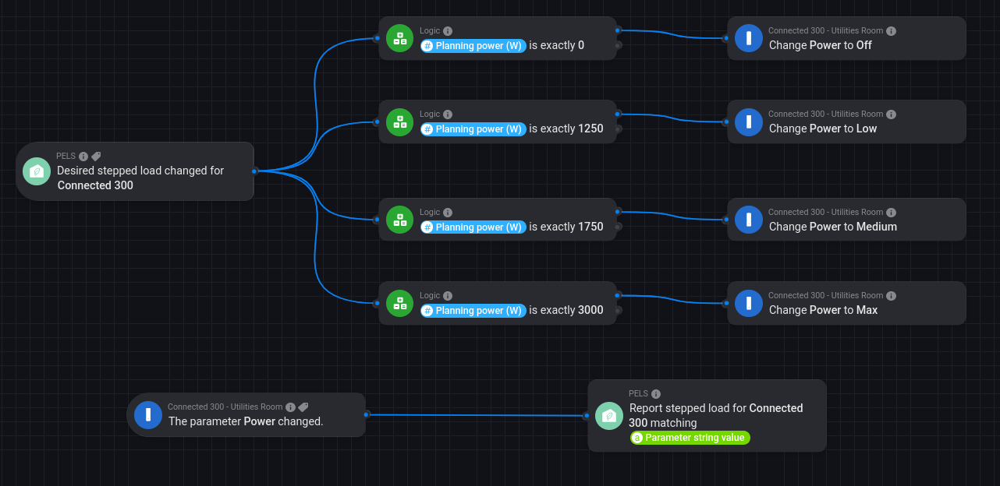

# How-To: Wire a Stepped Load Device to PELS

Use this pattern when a real Homey device has its own stepped power modes, but PELS should still decide which step to use.

Typical devices:

- water heaters with `Low/Medium/Max`
- EV chargers with stepped current/power levels
- other controllable loads with discrete states

For built-in stepped-load devices, PELS owns the decision and your Homey Flows only do the vendor-specific mapping.

*Figure 1. Example wiring for Høiax Connected 300: PELS emits the desired step, and the device reports its selected step back into PELS.*

## What You Are Building

Two Flow paths:

1. **Outbound desired-step mapping**
When PELS changes the desired stepped-load level, your Flow maps that generic intent to the vendor action card.

2. **Inbound step feedback**
When the device changes level, your Flow reports the selected step back into PELS.

This keeps three values separate:

- **selected step** on the device
- **measured power** right now
- **planning power** that PELS reserves for that step

## Why This Works

For stepped-load devices, `measure_power` is not enough to know the selected level:

- the heater may be set to `Max` while drawing `0 W`
- the live draw may be lower than the configured step
- the vendor app may report step changes separately from power

That is why PELS needs explicit step feedback from your Flows.

## Example Mapping (Connected 300)

| Step | Planning Power | Vendor Action |
|------|----------------|---------------|
| Off | 0 W | `Change Power to Off` |
| Low | 1250 W | `Change Power to Low` |
| Medium | 1750 W | `Change Power to Medium` |
| Max | 3000 W | `Change Power to Max` |

In the screenshot:

- the top Flow reacts to **Desired stepped load changed for Connected 300**
- each branch checks the **Planning power (W)** token and calls the matching Høiax action
- the bottom Flow listens for the device's own power or parameter change and reports the matching stepped-load level back into PELS

If your device app exposes a direct level trigger, prefer reporting the step directly with **Report stepped load for [device] as [step]**. If it only exposes a power value, use **Report stepped load for [device] matching [power]**.

## Setup Checklist

1. In the PELS device settings, set `Control model` to `Stepped load`.
2. Define the device steps and planning power values.
3. Choose the normal `When shedding` behavior:
   `Turn off` or `Set to step`
4. Create the outbound Flow from **Desired stepped load changed for [device]** to the vendor action cards.
5. Create the inbound feedback Flow with either:
   **Report stepped load for [device] as [step]**
   or
   **Report stepped load for [device] matching [power]**

## Common Pitfalls

- Forgetting the feedback Flow. Without it, PELS only knows what it last asked for.
- Treating `measure_power = 0` as if the selected step were `Off`.
- Mapping vendor power feedback to the wrong configured planning power.
- Using **Set expected power for device** for a stepped-load device. That card is legacy and is rejected for built-in stepped loads.

## PELS Cards Used

- **Desired stepped load changed for [device]**
- **Report stepped load for [device] as [step]**
- **Report stepped load for [device] matching [power]**
