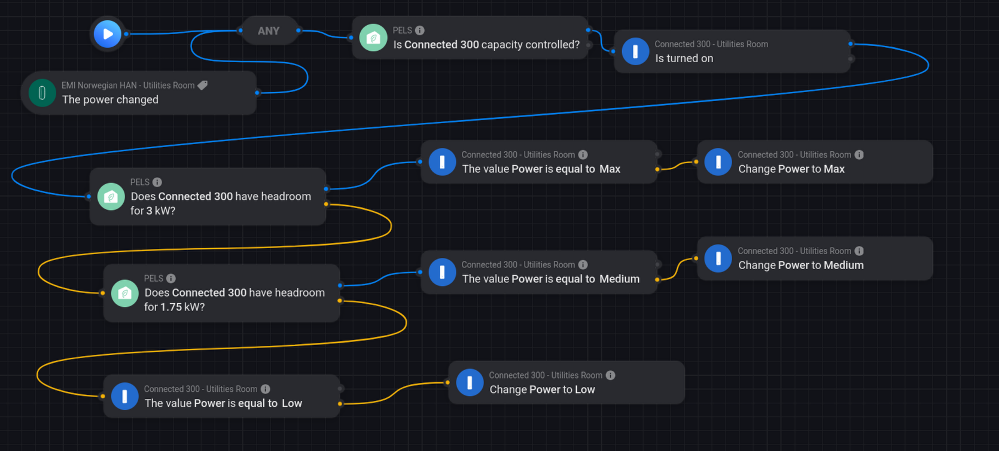
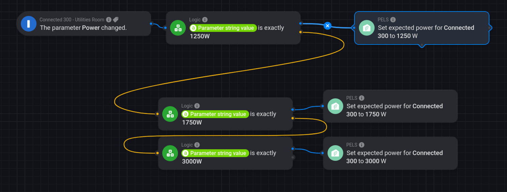

# How-To: Let PELS Manage Device Power Usage

Use this pattern when a device can run at different power levels, and you want PELS to select the best level automatically based on available headroom.

Typical devices:

- water heaters with `Low/Medium/Max`
- EV chargers with stepped current/power levels
- other controllable loads with discrete states

*Figure 1. Example of level selection based on headroom.*

*Figure 2. Example of expected-power updates when level changes.*

## What You Are Building

One flow pattern with two ideas:

1. **Level selection from headroom**
Choose the strongest level that fits current headroom.

2. **Expected-power sync**
When the level changes, immediately tell PELS what power to expect.

You can keep this in one Advanced Flow with branches, or split into two separate flows.

## Why This Works

PELS decisions depend on expected device usage.

If a device drops from high to medium or low, but PELS still expects the old high value, headroom checks become too conservative for a while. Updating expected power right away keeps the estimate accurate and reduces unnecessary waiting.

## Design Recipe (Generic)

1. Define your device levels from highest demand to lowest demand.
2. Assign a headroom threshold (kW) for each non-fallback level.
3. Assign expected power (W) for each level.
4. Evaluate levels top-down, then fall back to the lowest level.
5. On each level change, update expected power to the matching watts.

## Example Mapping (Connected 300)

| Level | Headroom Check | Expected Power |
|-------|----------------|----------------|
| Max | 3 kW | 3000 W |
| Medium | 1.75 kW | 1750 W |
| Low | fallback | 1250 W |

Decision shape:

- if 3 kW fits, use `Max`
- else if 1.75 kW fits, use `Medium`
- else use `Low`

## Quick Validation Checklist

- When headroom is low, the device goes to fallback level.
- When headroom increases, the device can step up.
- After each level change, expected power in PELS matches the new level quickly.
- No repeated "set same level" spam in the flow logic.

## Common Pitfalls

- Mixing units: headroom checks are **kW**, expected power updates are **W**.
- Missing one level in the expected-power mapping.
- Using multiple unrelated flows that fight each other.
- `settings.load` configured for the device: manual expected-power overrides are rejected by design.

## PELS Cards Used

- **Is there headroom for device?**
- **Set expected power for device**
