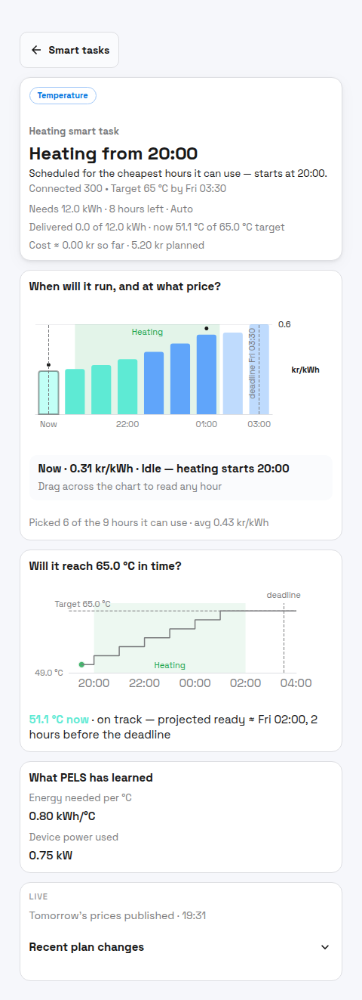

# Smart Tasks

Smart tasks tell PELS that one device should reach a target by a ready-by time.

Instead of simply allowing the device to run whenever there is available power, PELS plans the useful hours before the ready-by time. It prefers cheaper hours when prices are available, while still using the device priority, daily budget, power-limit control, and hard cap settings from the rest of your setup.

## What Smart Tasks Are For

Use a Smart task when the timing matters for one device:

- Charge an EV to a target battery percentage by 07:00.
- Heat a room to a target temperature before people wake up.
- Heat a water heater before a period when hot water matters.

If you only want the whole home to spend more energy during cheap hours, use [Daily Energy Budget](/daily-budget) instead. If you want a fixed number of cheap hours without a target, use [Book Cheap Hours With Flows](/how-to-book-cheap-hours-with-flows).

## How a Task Is Created

Smart tasks are created from Homey Flow action cards:

| Action card | Use for |
| --- | --- |
| **Add charging task** | EV chargers with a battery target and ready-by time |
| **Add heating task** | Temperature devices with a target temperature and ready-by time |
| **Clear smart task** | Removes the active task for the selected device |

The ready-by value is written as local time, for example `07:00`. PELS stores the next matching future time when the Flow runs. It does not automatically repeat the same task every day unless your Flow runs again.

## What PELS Plans

For each active task, PELS evaluates:

- the target
- the current observed progress, when available
- the ready-by time
- hourly prices through the ready-by time
- the device's expected or learned energy delivery
- the daily budget and hard cap
- the device priority and normal admission rules

The Smart task plan chooses hours before the ready-by time. If prices are available for the whole window, cheaper hours are preferred. If tomorrow's prices are needed but not available yet, the task can remain pending until the price window is complete.

*Figure 1. A Smart task plan shows the selected price horizon, expected device work, background usage, and target progress.*

## Power-Limit Control and Tasks

Power-limit control changes what happens outside the task's planned hours.

| Device setup | Outside planned task hours | During planned task hours |
| --- | --- | --- |
| **Power-limit control on** | The device can still run as part of normal PELS behavior when there is available power | PELS gives the task a planned opportunity to run, still under the hard cap |
| **Power-limit control off** | PELS keeps the device idle for the task unless another automation controls it | PELS makes the device available for the planned task hours |

For EV charging, a common setup is to keep the charger managed by PELS but turn power-limit control off until a charging task or Flow-booked hour allows it to run. That prevents the charger from starting just because the home has available power in an expensive hour.

## Budget and Task Interaction

Smart tasks do not replace the rest of PELS.

- The **hard cap** is still the hourly boundary PELS protects.
- **Daily budget** can make PELS more conservative if the day is already using too much energy.
- **Priority** still decides which devices get room first when not everything can run.
- **Price-based temperature shift** can still adjust normal temperature targets, but a heating task target is the readiness target for that task.

## Letting a Task Push Harder

By default a Smart task stays polite: it keeps to the daily budget and never takes power from devices you have ranked higher or equal. If a task is **At risk** of missing its target and the deadline matters, you can grant it extra leeway with the **Set what a smart task may do** action card.

| Permission | What it allows |
| --- | --- |
| **go over today's budget** | The device may keep running during its planned hours even when the daily budget would normally pace it down. The daily budget is a soft, price-shaped target, so this lets the task run past it. |
| **limit lower-priority devices** | The task may have lower-priority devices limited — paused or turned down — so it gets more room when available. Devices at the same or higher priority are never touched. |

For each permission you choose when it applies:

| When | Effect |
| --- | --- |
| **At no time** | The permission is off. |
| **While it's scheduled to run** | The permission applies during the task's planned hours, and stays set until you change it or clear the task. |

Two things stay true no matter what you grant:

- Both permissions stay inside the **hard cap**. PELS never exceeds your physical capacity limit to rescue a task. If a task still cannot finish within the hard cap, the fix is a lower daily budget or fewer competing devices — not a higher cap.
- Permissions persist once you grant them, but they have no effect until the planned hours or the rescue gate apply — so a task already on track stays on its normal plan.

### Example: a water heater that must be ready

A water heater is set to reach 65 °C by 07:00 with cheap overnight hours booked. Someone showers at 21:00 and the tank drops well below target, leaving the morning short. To keep mornings covered, grant the task either permission:

- **go over today's budget** so the heater can reheat during its planned hours even if the day's budget is tight.
- **limit lower-priority devices** so it can take room from loads you care about less.

You can grant the leeway as a standing setting once the task exists, or only when time is short. Pair **Smart task time is running low** (for example, 2 hours left) with **Smart task status is At risk** so a Flow grants the permission late — only when a task actually needs the help.

## Different Targets Can Be Useful

A mode target, a boost setting, and a Smart task target do not have to be the same value. They describe different intent:

| Setting | What it means |
| --- | --- |
| **Mode target** | The normal target for the active mode, such as Home, Night, or Away. |
| **Boost setting** | A temporary extra push, such as cheap-hour temperature boost or charge boost when a battery is low. |
| **Smart task target** | A one-off readiness goal by a specific time. |

That separation is often useful. For example, a room can normally sit at 18 °C in Night mode, use cheap-hour boost when prices are low, and still have a task to reach 21 °C by 06:30. An EV charger can have a low charge-boost threshold for basic readiness while a charging task aims for a higher target before a trip.

For many homes, this is the useful combination:

1. Power limiting protects the capacity step.
2. Daily budget shifts whole-home usage toward cheaper hours.
3. Smart tasks reserve attention for specific devices that must be ready.

## Status and History

The Smart tasks view shows current tasks and past tasks. Flow cards can also react to status changes.

| Status | Meaning |
| --- | --- |
| **Building plan…** | A task is stored but PELS has not allocated hours yet — usually because prices through the ready-by time are not available. |
| **Scheduled** | A plan is ready and the first scheduled hour is still in the future. |
| **Paused — unplugged** | EV only: the charging task is paused because the car is unplugged or the session ended. The plan resumes when the car is plugged back in. |
| **On track** | PELS currently expects the task to reach the target. |
| **At risk** | PELS has a plan, but there is limited time or room left. |
| **Cannot finish** | PELS does not currently see enough usable time or energy delivery before the ready-by time. |
| **Satisfied** | The observed target is already met. If a later reading drops below the target before the ready-by time, PELS returns to tracking it. |

If no active task is stored for a device, that device simply has no Smart task status.

Use **Smart task status changed** for live notifications as a task is being tracked. Use **Smart task ended** when you want an alert after the task run concludes — it fires once with an **Outcome** tag of `succeeded`, `missed`, or `abandoned`. Filter on the tag for the case you care about, for example `Outcome = missed` for a "task did not reach its target" notification.

## Practical Examples

### Charge an EV by morning

Create a Flow that runs when the car is plugged in:

| Flow part | Card |
| --- | --- |
| **When** | Charger or car app: plugged in |
| **Then** | PELS: **Add charging task** |

Set the target battery percentage and ready-by time, for example `80 %` by `07:00`.

Recommended charger setup:

- **Managed by PELS** on
- **Power-limit control** off by default if charging should only happen during planned task hours
- EV current-control Flow wired as described in [Configure an EV Charger](/ev-charger)
- Battery reporting Flow configured when your car or charger app can provide it

### Heat before a known time

Create a scheduled Flow:

| Flow part | Card |
| --- | --- |
| **When** | Time is 20:00 |
| **Then** | PELS: **Add heating task** |

Set the target temperature and ready-by time, for example `21 °C` by `06:30`.

This is useful for rooms or water heaters where the exact ready time matters more than simply reacting to the current price level.

## Troubleshooting

| Problem | What to check |
| --- | --- |
| The task stays pending | Check that price optimization is enabled and that prices are available through the ready-by time. |
| The EV task does not change charger current | Confirm the charger is configured as EV 1-phase or EV 3-phase and the Flow uses **EV charger current (A)**. |
| The task starts too early | Check whether **Power-limit control** is on; with it on, normal PELS behavior can still run the device outside planned task hours. |
| The task cannot meet the target | Check target size, ready-by time, planning power/current, daily budget, and device priority. |
| A completed task starts tracking again | This is expected if a fresh reading drops below the target before the ready-by time. |
