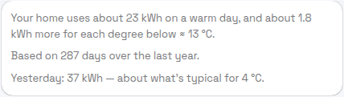
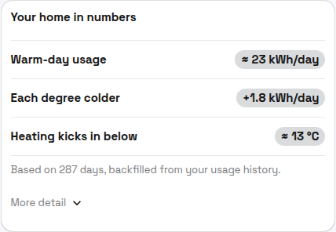
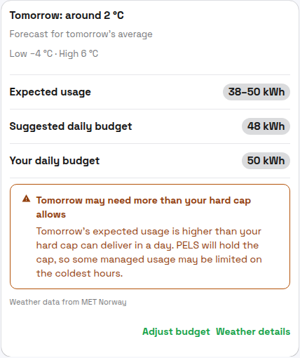

# Weather Insight

Weather insight learns how your home's daily energy use changes with the weather, then looks at tomorrow's forecast and tells you, the evening before, whether tomorrow is likely to fit inside your daily budget. It answers the one question a daily budget can't answer on its own: *"what number should I even set, and is tomorrow going to blow it?"*

It does this in two parts:

- **It learns your home.** PELS matches your past daily energy use against the outdoor temperature on each of those days, building a plain-language picture of your home — roughly how much it uses on a mild day, and how much more it uses for each degree colder.
- **It looks at tomorrow.** PELS fetches tomorrow's forecast for your location from [MET Norway](https://www.met.no/) and combines it with what it learned to predict tomorrow's total energy use, and to suggest a daily budget that should cover it.

The whole feature is **optional and off by default.** It only earns its place if you run a [daily budget](daily-budget.md) — its job is to help you choose and trust that number.

## Why turn it on?

- **Stop guessing the daily budget number.** Picking a daily kWh target is the hardest part of setting up a budget. Weather insight turns "is 50 kWh about right?" into "tomorrow will likely use 38–50 kWh, so 50 covers it." You can read the suggestion and set the budget yourself, or let PELS apply it for you.
- **Get a heads-up the night before.** On a cold snap, weather insight warns you that tomorrow may use the whole budget — *before* the day starts, not after the 24-hour usage data finally catches up. That early warning is the difference between adjusting a setting and reading a post-mortem.
- **See that it actually learned your home.** The detail view shows the numbers and the chart behind every prediction, so you can check what PELS learned against your own intuition rather than trusting a black box.

**You may not need it.** If you don't run a daily budget, there is nothing for the suggestion to feed. And if your home's energy use barely changes with the weather — common for homes without electric heating — weather insight will tell you so rather than invent a pattern.

## Turning it on

Open **Settings → Weather insight** and turn on the master switch, then pick the device that measures your **outdoor** temperature. PELS confirms the device works straight away with a live reading, so you don't have to wait weeks to find out you picked the wrong sensor.

*Figure 1. Settings → Weather insight. Turn on the master switch and pick the device that reads outdoor temperature. Tomorrow's forecast comes from MET Norway automatically — there is no forecast device to configure. The live "Reading 4 °C now" line confirms the sensor before PELS starts learning.*

**It needs about 21 days of data — but usually not 21 days of waiting.** PELS needs roughly **21 usable days** of paired usage and temperature before it shows an estimate. When you turn it on, it reads up to a year of your past usage and matches it against past temperatures, so a home that already has that history reaches the threshold soon after setup instead of waiting three weeks of fresh measurements. Until it's ready, the Budget page shows a short "learning your home" card with a day count, and the chart fills in as the data arrives.

## Tomorrow's outlook on the Budget page

Once PELS has learned enough, a **Tomorrow** card appears at the bottom of the [Budget](daily-budget.md) page — after the chart, so it never displaces the at-a-glance "where will I land today?" summary.

*Figure 2. The Tomorrow card answers, "is tomorrow going to fit?" It shows tomorrow's forecast temperature and swing, the expected usage range, the budget PELS suggests, your current budget, and a one-line verdict comparing the two.*

The rows mean:

| Row | What it tells you |
| --- | --- |
| **Expected usage** | The range PELS expects tomorrow's total to land in, given the forecast and what it learned. A wider range means more uncertainty. |
| **Suggested daily budget** | A daily budget that should comfortably cover tomorrow. Display-only unless you opt in to auto-apply. |
| **Your daily budget** | Your current daily budget, for comparison. |

The **verdict line** is the headline. It says, in plain words, how your current budget compares with what tomorrow is expected to need:

- *"Your budget covers tomorrow with room to spare."* — comfortable.
- *"Your budget should cover tomorrow."* — fine, with less slack.
- *"Tomorrow may be tight — a cold evening could use the whole budget."* — a heads-up; PELS only mentions a cold evening when the forecast evening genuinely runs cold.
- *"Tomorrow likely needs more than your budget. PELS will hold managed devices back to stay inside it."* — your budget is below what tomorrow is expected to need, so managed devices will be paced harder to stay within it.

A **Rough estimate** chip appears when tomorrow is colder than anything PELS has measured, or when recent days have drifted from the usual pattern — its companion line explains why the range is wider than usual.

## What PELS learned about your home

Tap **Weather details** on the Tomorrow card to see what PELS learned behind the prediction. This is the page to open when you want to check that PELS actually understands your home.

It opens with a plain-language summary and a per-day breakdown:

*Figure 3. The summary sentence describes your home the way you'd describe it to a neighbour: a warm-day baseline, plus how much each degree of cold adds. The "yesterday" line sanity-checks the estimate against the most recent real day.*

*Figure 4. The same picture as numbers. "Heating kicks in below" is the balance point — the outdoor temperature where your home starts spending energy on heating. The "More detail" expander adds the uncertainty range and, for heat-pump homes, a note about steeper usage on the coldest days.*

Below that, a chart plots every day of the last year so you can see the pattern with your own eyes:

*Figure 5. Each dot is one day. The line is PELS's estimate of typical usage at a given temperature; the hollow dot is tomorrow's forecast placed on it. The band under the chart shows which temperatures PELS has plenty of data for (darker) versus few (lighter) — so you can tell where the estimate is solid and where it's a rougher guess.*

## When tomorrow needs more than your hard cap

If tomorrow's expected usage is more than your [hourly hard cap](getting-started.md#terminology-and-units) could physically deliver across a whole day, the Tomorrow card replaces the calm verdict with a warning.

*Figure 6. When the suggestion bumps against the hard cap, PELS warns you plainly and tells you what will happen: it holds the cap and limits some managed usage on the coldest hours.*

The hard cap is a **physical limit** — your grid tariff step or breaker — not a budget you can nudge up to make the warning go away. Raising it to fit a cold day would defeat its purpose. The honest response to this warning is to expect that managed devices (water heater, floor heating, EV charging) will be paced harder on the coldest hours, and to plan flexible load accordingly.

## When the forecast isn't available

Tomorrow's forecast comes from a live MET Norway request keyed to your Homey hub's location. When PELS can't get a usable forecast — the service is briefly unavailable, or your hub has no location set — it falls back to what the last several days of weather suggest and labels the card *"Forecast unavailable — showing what recent weather suggests."* The prediction still works; it's just based on recent days rather than tomorrow's specific forecast.

The *"Weather data from MET Norway"* attribution on the card and in the detail view is required by MET's terms whenever forecast data is shown.

## Auto-applying the suggested budget

By default the suggestion is **display-only** — *Adjust budget* opens the normal [budget adjust flow](daily-budget.md#where-to-configure-it) with nothing pre-filled, so you stay in control of the number.

If you'd rather not think about it, turn on **Apply the suggestion automatically** on the Settings sub-page (Figure 1). Each day, PELS replaces your daily budget with that day's suggested value. This is the most hands-off way to run a budget that tracks the weather. It is off by default, and it does nothing unless the daily budget itself is enabled — the sub-page tells you so if it isn't.

## What it doesn't do

Weather insight is deliberately scoped. It does **not**:

- **Predict tomorrow's cost.** It predicts kWh, not kroner — prices for the next day aren't fully known when the outlook is built. To shift usage toward cheaper hours, that's the [daily budget's price shaping](daily-budget.md#how-the-plan-works-high-level).
- **Appear anywhere but Budget and Settings.** Nothing on Overview, Usage, widgets, or notifications. The outlook lives where the "where will I land?" question already lives.
- **Handle cooling well yet.** PELS currently assumes colder days use more energy. A home that runs air conditioning on hot days may be under-estimated on the first warm days of the season; PELS fills that in as it sees warm-weather data.

## How it fits with the daily budget

Weather insight is an **input to the daily budget**, not a separate controller. The suggestion and verdict are about the daily budget's number; the daily budget is what actually paces your home. And the daily budget, in turn, never overrides the hourly hard cap.

So the chain is: weather insight suggests a number → the [daily budget](daily-budget.md) paces the day toward it → the [hard cap](technical.md) protects your grid connection no matter what. For how PELS makes decisions across all three, see [How PELS decides](how-pels-decides.md).

## Terminology

Shared capacity terminology and units are defined in [Getting Started: Terminology and Units](getting-started.md#terminology-and-units). Weather-insight-specific terms:

- **Balance point** ("Heating kicks in below") — the outdoor temperature where your home starts spending extra energy on heating. Above it, usage is roughly flat; below it, usage climbs with the cold.
- **Warm-day usage** — the roughly flat daily energy your home uses when it isn't heating: lights, appliances, hot water, standby. Distinct from "background usage" in the daily budget, which is about devices PELS doesn't manage.
- **Expected usage range** — the spread PELS expects tomorrow's total to fall within. It widens when the forecast is colder than anything measured, or when recent days have drifted from the pattern.
