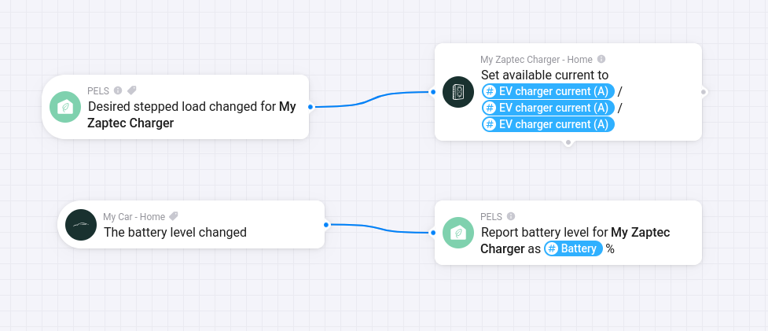

# Configure a Zaptec EV Charger

Start with [Configure an EV Charger](/ev-charger). This page only covers what is different for Zaptec.

Zaptec exposes the selected charger current to Homey, so PELS can read the current step automatically. You do not need the generic selected-current feedback Flow for Zaptec.

The Zaptec-specific Flow is only the outbound current-control Flow. Zaptec asks for available current in amps, so wire PELS' **EV charger current (A)** tag into the Zaptec action card.

*Figure 1. Example Zaptec wiring: PELS emits the desired charger current, and the car battery level is reported back to PELS.*

## Current-Control Flow

Use this Flow shape:

| Flow part | Card |
| --- | --- |
| **When** | PELS: **Desired stepped load changed for** your Zaptec charger |
| **Then** | Zaptec: **Set available current to** |

In the Zaptec action card, use the PELS Flow tag **EV charger current (A)** for the available-current value.

PELS handles the 1-phase or 3-phase conversion based on the EV control mode selected in PELS. Do not use **Planning power (W)** for the Zaptec current field unless you are intentionally building a manual conversion Flow.

## Battery Reporting

The generic EV charger guide covers battery reporting. For Zaptec, choose the same Zaptec charger in **Report battery level for charger** as you use in the current-control Flow.

That adds battery reporting to PELS, which can be used by EV boost mode.

## Related Pages

- [Configure an EV Charger](/ev-charger)
- [Flow Cards](/flow-cards)
